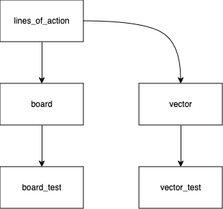

# Assignment #5: Lines of Action

## Overview

You will implement a two-player version of the board game Lines of Action.  The
[rules](https://en.wikipedia.org/wiki/Lines_of_Action) are available online.

Your version does not need to be as fancy, but it must:

* Implement the user interface with `graphics.py`.
* Show legal moves (highlight the selected piece and possible moves).
* Prohibit illegal moves.
* Detect when the game is over and who has won (it is much easier to display
  this information on the console, using print statements, rather than
  displaying it graphically).
* We use the version of the rules where the game is a tie if both players
  connect all of their pieces at the same time.
* Be fully object-oriented.
* Include unit tests.

You are implementing a game for two human players; you do not have to write an
artificially intelligent opponent.

## Hints

The design is up to you, but here's one reasonable option:

Don't go overboard creating objects.  Even though pieces are physical "objects,"
it's simpler to represent the board as a two-dimensional array of, say, `int`s,
with the entry at each location indicating whether it is black, white, or
vacant.

Break down complicated methods, separate control from data, and take advantage
of existing data structures.

Wins are detected using depth-first search (which we will discuss in class).

## What To Hand In

Hand in all of your `.py` files including tests.
