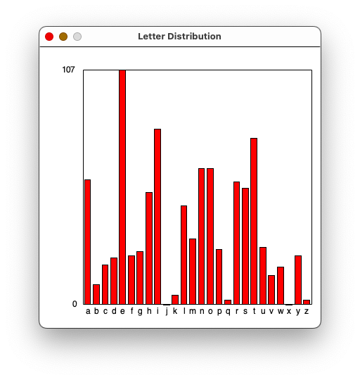

# Pair Project #1: Letter Distribution

This is a pair programming project.  Work with your assigned partner.  Only one
of you has to turn it in, but make sure you don't both think the other one was
doing it.

## Overview

Write a program to count the distribution of letters in a text file.  The letter
counts should be printed out and displayed as a bar chart.  For example, when
run on the first paragraph of Herman Melville's novel Moby Dick,
it should print:

```
a: 57
b: 9
c: 18
d: 21
e: 107
f: 22
g: 24
h: 51
i: 80
j: 0
k: 4
l: 45
m: 30
n: 62
o: 62
p: 25
q: 2
r: 56
s: 53
t: 76
u: 26
v: 13
w: 17
x: 0
y: 22
z: 2
```

and draw a good approximation of this diagram:



The program should work on any plain text file, with changing the filename
being the only modification needed to the code.  You can test it on these two
files:

* [para1.txt](./para1.txt) (the first paragraph of Moby Dick, which should
  produce exactly the output above)

* [2701-0.txt](http://www.gutenberg.org/files/2701/2701-0.txt) (the entire text
  of the novel)

## Hints

Remember the functions `chr()` and `ord()` to convert between integers and
characters.

Here are a few lines of Python code that shows how to read the entire content of
a file named `para1.txt` and store it in a variable as a (possibly long) list of
strings (one per line):

```python
with open('para1.txt') as f:
    text = f.readlines()
print(text[0])  # print the first of the text
```

We will use the `graphics.py`
[package](https://mcsp.wartburg.edu/zelle/python/graphics/graphics.pdf) for many
of our drawing tasks this term including for this project.

To install this package, you may have to type the following command in the
terminal (only needed once):

```bash
pip3 install graphics.py
```

To use this package in your program, you must first import it.  Place the
following line near the top, by convention, just after the top-level docstring:

```python
import graphics as g
```

Then, you can create a drawing canvas with this line:

```python
win = g.GraphWin('Letter Distribution', 400, 400)
```

You can save yourself a lot of math by adjusting the scale of the drawing with
this line:

```python
win.setCoords(-5, -0.1, 27, 1.1)
```

This way, you can give `a` an x coordinate of `0`, `b` an x coordinate of `1`,
and so on.  You will still need to scale the counts into the 0.0 to 1.0 range by
dividing by the maximum count.

To see your drawing, add the following line as the last line of your program:

```python
win.getMouse()
```

When executing, this line causes your program to wait until you click somewhere
in the drawing.  Once you click in the drawing, your program will exit.

See the `graphics.py`
[manual](https://mcsp.wartburg.edu/zelle/python/graphics/graphics.pdf) for other
important functions needed to draw the diagram.

## What To Hand In

Hand in your one file `lettercounter.py` through Google classroom.

Include the names of both participants in a comment at the top of your code (if
one person didn't contribute, don't include their name).
