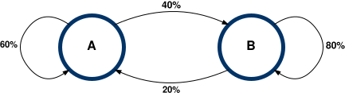

# CS2 Fall 2024 Note 13

## Life of two particles

A particle jumps between positions A and B with the following probabilities:



Assuming the particle starts in position `A`, what is the probabity that the
particle is in position `A` after `n` steps?

(Courtesy of MIT OpenCourseWare, [CC BY-NIC-SA
4.0](https://creativecommons.org/licenses/by-nc-sa/4.0/ ).)

## Stochastic matrices

We can model the system above with stochastic matrices.
[Wikipedia](https://en.wikipedia.org/wiki/Stochastic_matrix) defines a
stochastic matrix as

> a square matrix used to describe the transitions of a Markov chain.  Each of
> its entries is a nonnegative real number representing a probability.

## The Python program

### Import our library

```python
import linear_algebra
```

### Parameters

```python
"""Number of steps."""
n = 1

"""Stochastic matrix for our two-particle system."""
A = [
    [0.6, 0.2],
    [0.4, 0.8]
]

"""Initial position (defined as a matrix)."""
p0 = [
    [1.0],
    [0.0]
]
```

### Use our library

```python
p = p0
p = linear_algebra.mproduct(M, p)
```

### Print the 2x1 matrix

```python
def print_p(p : list[list[float]]) -> None:
    """Print a probability vector (shape: 2x1)."""
    for i in range(len(p)):
        print('| {:-.3f} |'.format(p[i][0]))
```

## Formatting

Strings with embedded `{}`'s along with the function `format` can be used to
control how information is displayed.  Detailed information and examples are
availabl through the [official Python
documentation](https://docs.python.org/3/library/string.html#format-string-syntax).
