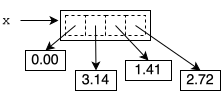
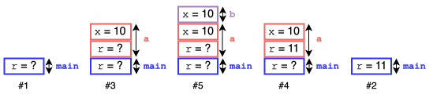
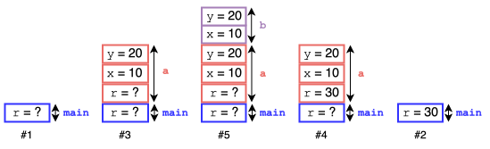

# CS2 Fall 2024 Note 15 Answer Key

### References

The list `x` pictorially:



### Calling stack

The calling stack for the first program:



The calling stack for the second program:



### Conversions

How do you convert a value into a string?  `str(val)`

How do you convert a string into an integer?  `int(s)`

How do you convert a string into a `float`?  `float(s)`

How do you convert a `float` to the nearest integer?  `round(f)`

How do you get the ASCII code of a character?  `ord(c)`

How do you get the character corresponding to a particular ASCII code?  `chr(i)`

What is the maximum value of an `int`?  An `int` value can be arbitrarily large,
only constrained by the amount of available memory in your computer.

### Collections

How do you initialize a set with the elements 1, 2, 3?  With curly braces, `set
= {1, 2, 3}`.

Does the order of elements in the set literal matter?  No, `{1, 2, 3}` is the
same as `{2, 3, 1}`.

How do you initialize a tuple with the elements 1, 2, 3, in that order?  With
parentheses, `tuple = (1, 2, 3)`.

How do you check for membership in a set?  With the `in` operator, `1 in {1, 2,
3}`.

How do you add and remove an element from a set?  `set.add(4)`, `set.remove(4)`.

Do sets allow duplicates?  No, `{1, 2, 3, 3}` is the same as `{1, 2, 3}`.

Do tuples allow duplicates?  Yes, `(1, 1, 2)` is different than `(1, 2)`.

### Testing

What is the naming convention of test functions in a `pytest` test module?  The
name of each of the test function must begin with the prefix `test_`.

What claim does the following assertion make?

```python
assert square(4) == 16
```

If the `square` function is called with argument `4`, it will return `16`.
